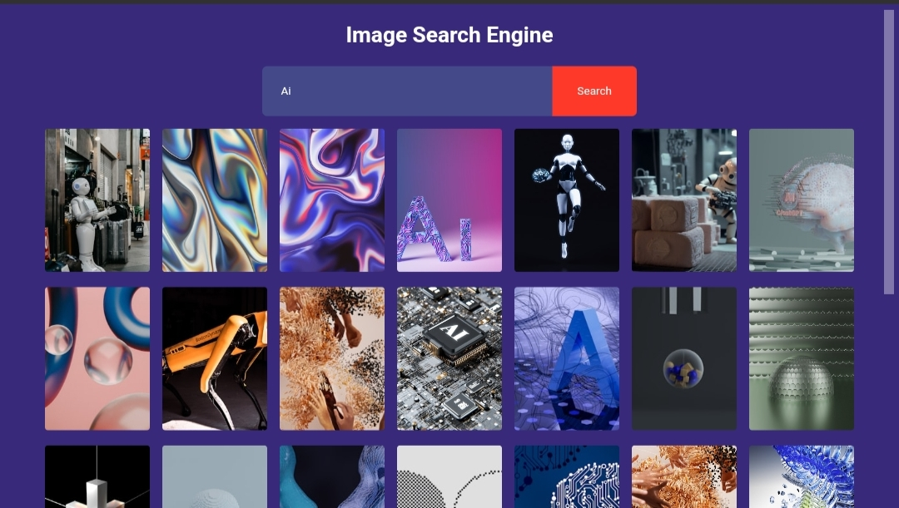

# **ChitraKhoj - Image Search Engine**

Welcome to **ChitraKhoj**, a sleek and intuitive image search engine powered by the **Unsplash API**. Search for stunning images effortlessly and dive into a world of **visual inspiration**.

---

## ✨ Features

* **Simple & Elegant UI**
  Clean design with a fully responsive layout.

* **Fast Search**
  Powered by the Unsplash API for blazing-fast image retrieval.

* **Infinite Scroll**
  Click “Show More” to seamlessly load more results.

* **Cross-Platform Compatibility**
  Works beautifully on both desktop and mobile devices.

---

## 🚀 Demo



---

## 🛠️ Installation

Follow these steps to set up **ChitraKhoj** locally:

### 1. Clone the Repository

```bash
git clone https://github.com/imvishal612/ChitraKhoj.git
cd ChitraKhoj
```

### 2. Open the Project

Simply open `Img.html` in your browser to start using the app.
No additional dependencies required!

> **Optional:** Use a local server (e.g., **Live Server** in VS Code) for a smoother development experience.

---

## 📖 Usage

1. Enter a search term in the input box (e.g., `"nature"`, `"cats"`, `"technology"`).
2. Click the **Search** button or press **Enter**.
3. Browse results and click **Show More** to load additional images.

---

## 🧑‍💻 Technologies Used

* **HTML5** – Structure of the app
* **CSS3** – Stylish, minimalistic design
* **JavaScript** – Dynamic features and API integration
* **Unsplash API** – Source of high-quality images

---

## 📜 License

This project is licensed under the **MIT License**.
See the [LICENSE](LICENSE) file for details.

---

## 🤝 Contributing

Contributions are welcome!

1. **Fork** the repository
2. Create a **new branch**

   ```bash
   git checkout -b feature-branch
   ```
3. **Make your changes** and commit

   ```bash
   git commit -m "Add feature"
   ```
4. **Push to your branch**

   ```bash
   git push origin feature-branch
   ```
5. Open a **Pull Request**

---

## 📧 Contact

Created by [**Singh Vishal**](imvishal612@gmail.com)
Feel free to reach out—your feedback is appreciated!

---

**Happy searching with ChitraKhoj!**

---
